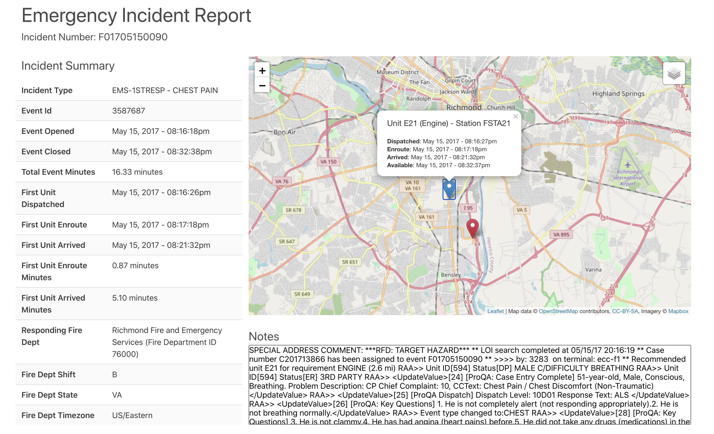

# Emergency Incident Dashboard Demo

An application that displays key information regarding 911 emergency incidents, including weather conditions at the time of the incident and geospatial data for incidents and responders



## Quick Start

```bash
npm install
npm run build
npm start
```

Navigate to http://localhost:3000

## What I Would Change, Given More Time

So much. Off the top of my head:

**General**:

- I wouldn't expose any API keys right in the code :P. I'd store them in AWS Secrets Manager.
- Tests! I would want as close to 100% test coverage as I could get. Mainly because I like to sleep at night.
- Ideally, the UI application would be entirely from API(s), which would federate and aggregate relevant data from other systems (like internal micro services)
- General organization: Given enough time, I like to organize files and functions into small, reusable, composable, (ideally generalized), documented, logical, testable units. (You know, [Unix philosophy](https://en.wikipedia.org/wiki/Unix_philosophy) stuff)
- I would clear up any ESLint errors

**Front End**:

- Reduce the size of Webpack `bundle.js`
- Allow the user to select an incident from a list of incidents (rather than passing an ID as a query param)
- Use Redux for state management (Not as relevant for this demo, which renders a single incident and then doesn't change)
- Thoroughly test in multiple browsers and on multiple devices and make sure that the dashboard looks great at any resolution.
- Better leverage SASS and make the overall UI more polished and less bland.
- Use more interesting and meaningful map icons for incidents and responders. For example, incidents like Fires, Hazmat, and EMS incidents could be represented with flame, haz-mat/biohazard, and EMS (star of life) icons. Similarly, responding units could have different icons for different types.
- Generally, make as much use of reusable components as possible. The `IncidentMap` component for example, ideally should just be a `Map` that just displays generic map data.
- I would use CSS styles for vertical spacing instead of just throwing in `<br />` tags when needed.

**Back End**:

- Use an actual database instead of a pretend one
- Depending on how deep we need to go with enriching incident data, there could be a whole network of internal and external services and APIs that our API would coordinate with.
- Organize routes separate from app startup
- Use ES module imports instead of `require`

**Time Spent**: Approximately 9 Hours
